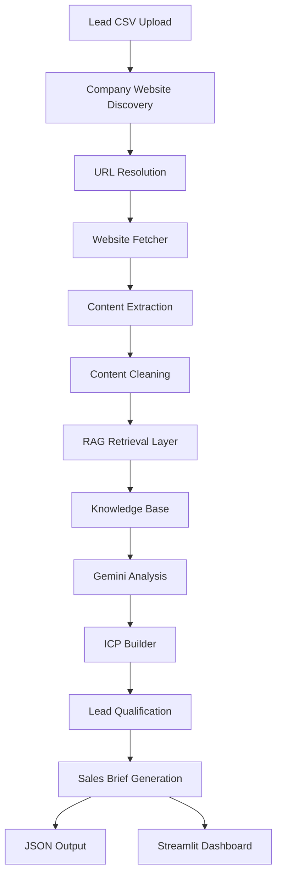

# Sales Intelligence Automator

**Author:** Sakshi Shah

An AI-powered lead research and sales intelligence platform that automates company discovery, website analysis, lead qualification, and sales brief generation.

The system helps sales teams reduce manual research by automatically gathering company information and generating structured discovery insights using Google Gemini.

---

# Overview

Sales Intelligence Automator streamlines the early stages of the sales process by:

* Discovering company websites
* Scraping and extracting business information
* Cleaning and structuring website content
* Analyzing companies using Google Gemini
* Qualifying leads based on predefined criteria
* Generating sales-ready intelligence briefs

The platform is designed to accelerate prospect research and improve discovery call preparation.

---

# Features

## Lead Processing

* Upload leads via CSV
* Batch lead processing
* Automatic website discovery
* Company domain validation

## Website Intelligence

* Website scraping
* Content extraction
* Content cleaning
* Noise removal (navigation, scripts, footer content)

## AI-Powered Analysis

* Company overview generation
* Industry identification
* Service and product detection
* Target customer analysis
* Business qualification

## Sales Brief Generation

* Lead qualification insights
* Sales-ready company summaries
* Actionable prospect intelligence
* Structured JSON output

## Interactive Dashboard

* Built with Streamlit
* Real-time processing status
* Lead analysis visualization
* Downloadable results

---

## System Architecture



---

## Project Structure

```text
sales-intelligence-automator/

├── app.py
├── README.md
├── requirements.txt
├── .env
├── .gitignore
├── test_gemini.py

├── ai/
│   ├── analyzer.py
│   ├── gemini_client.py
│   └── prompts.py

├── config/
│   └── default_icp.py

├── data/
│   ├── leads.csv
│   └── output.json

├── knowledge/
│   └── company_services.txt

├── models/
│   ├── lead.py
│   ├── sales_brief.py
│   └── icp_profile.py

├── rag/
│   ├── embedder.py
│   ├── retriever.py
│   └── vector_store.py

├── scraper/
│   ├── cleaner.py
│   ├── config.py
│   ├── extractor.py
│   ├── fetcher.py
│   ├── url_resolver.py
│   └── web_scraper.py

├── services/
│   ├── company_resolver.py
│   ├── icp_builder.py
│   └── lead_processor.py

├── utils/
│   ├── helpers.py
│   └── logger.py

└── screenshots/
    └── SIA.png
```

---

# Technology Stack

## Backend

* Python 3.11+
* Requests
* BeautifulSoup4
* Pandas
* Pydantic

## AI

* Google Gemini 2.5 Flash

## Frontend

* Streamlit

---

# Installation

## Clone Repository

```bash
git clone https://github.com/sakshu18/sales-intelligence-automator.git

cd sales-intelligence-automator
```

## Install Dependencies

```bash
pip install -r requirements.txt
```

## Configure Environment Variables

Create a `.env` file:

```env
GEMINI_API_KEY=YOUR_GEMINI_API_KEY
```

---

# Running the Application

```bash
streamlit run app.py
```

Open:

```text
http://localhost:8501
```

---

# Input Format

Upload a CSV file:

```csv
company_name,website
Houston Roofing,https://www.houstonroofingonline.com
ABC Construction,https://www.abcconstruction.com
```

---

# Output Example

```json
{
  "company_name": "Houston Roofing",
  "company_overview": "Residential and commercial roofing contractor.",
  "industry": "Construction",
  "core_services": [
    "Roof Replacement",
    "Roof Repair"
  ],
  "target_customers": [
    "Homeowners",
    "Commercial Property Owners"
  ],
  "qualification": "Qualified Lead"
}
```

---

## Application Preview

### Dashboard

The Streamlit dashboard provides an end-to-end workflow for lead research, qualification, and sales brief generation.


Key capabilities demonstrated:

- CSV lead upload
- Automated website research
- AI-powered company analysis
- Lead qualification
- Sales brief generation
- Downloadable JSON reports

# Future Enhancements

* Multi-page crawling
* Async processing
* CRM integrations (HubSpot, Salesforce)
* Lead scoring engine
* RAG-based knowledge enrichment
* ChromaDB / FAISS vector search
* PDF export
* Analytics dashboard
* Multi-user support

---

# License

This project was developed as part of a technical assessment and is intended for educational and demonstration purposes.
